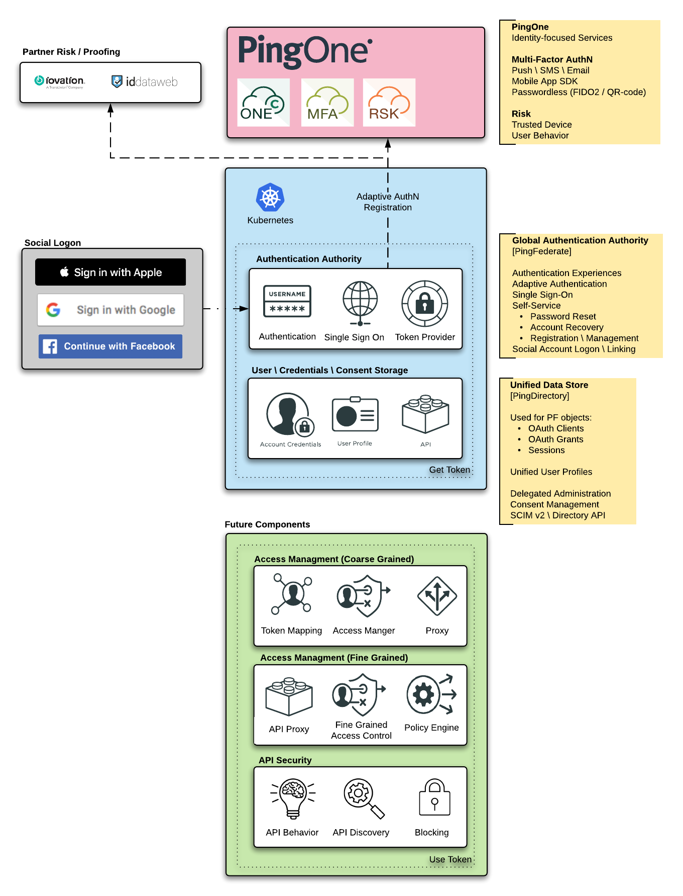

# Sample CIAM stack

This repo provides a sample CIAM configuration for PingDirectory \ PingFederate \ PingDataSync \ PingOne MFA

---

## Pre-Requisites

The stack will stand up without any pre-requisites, but will require manual configuration for MFA to work.

The Solution can be pre-configured for Admin SSO and PingOne MFA with details for the below injected into the configuration:

* My Ping Console:
  * [Configure](/docs/sso-myping.md)
* PingOne Ping Platform App
* PingOne MFA Native App

## Deployment

This repo contains configuration sets for deployment:

* [Docker Compose](deployment/Compose)
* [Kubernetes](deployment/Kubernetes)
  * [Helm](deployment/Kubernetes/helm)

### Deployment Configuration

The bulk of the configuration is performed by a Postman API Collection:  
[Customer360 - Postman Collection](https://documenter.getpostman.com/view/1239082/T1LQhmBu)

[Post Deployment Considerations](docs/post-deployment.md)

## Solution Configuration

| Product | Console URL |
| ----- | ----- |
| My Ping Console | `https://console.pingone.com/index.html?env={{myPingEnvId}}`
| [PingCentral](docs/solution-pc.md) | `https://{{PC_HOSTNAME}}:9022` |
| [PingDataSync](docs/solution-pd.md) | `https://{{PD_HOSTNAME}}:8443/console` |
| [PingDirectory](docs/solution-pd.md) | `https://{{PD_HOSTNAME}}:8443/console` |
| [PingFederate](docs/solution-pf.md) | `https://{{PF_HOSTNAME}}:9999/pingfederate` |
| PingOne MFA | Access from My Ping Console |
